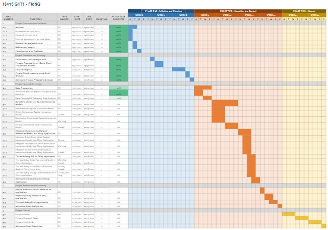

```{r setup, include=FALSE}
knitr::opts_chunk$set(echo = TRUE)
```

# Background

Peak hour crowds in public transportation have always been a problem. The Land Transport Authority (LTA) has implemented a variety of measures to address this issue by increasing the frequencies of trains and buses during peak hours, and giving fare discounts to those who travel earlier than the morning peak hours.

# Project Motivation 

There is presently no analytics application that looks at public transportation commuter patterns across time and space. We hope that creating this application can bring benefits to multiple stakeholders: by allowing commuters to better plan their journeys, workplaces to effectively implement flexible working hours, and the relevant governmental organisations to implement measures to address peak hour crowds.

Since the pandemic, even though there are people who are less willing to take the public transport, there is still a crowd in ridership at certain times. An example would be when Mass Rapid Transport (MRT) services broke down in October 2020, this resulted in bus stops being packed with commuters looking for alternatives to get home. This is a cause for concern for commuters who are conscious of COVID-19 risks as it is tough to maintain a safe distance from everyone around them.

The government has implemented measures to address peak hour crowds, including increasing the frequency of buses and trains during these periods. While this does solve the issue, we wonder about the sustainability of increasing the frequency of public transport - particularly buses, when public transportation ridership is going to increase over the years.

# Project Objectives 

In our project, we will build an application to investigate commuter patterns for bus services across time and space and how they contribute to peak hour crowds. 

Namely, we wish to cover the following areas:

- Identify the areas that have the most people travelling to and from (across time)
- Visualise modelling results of potential results

    + Unconstrained Spatial Interaction Model
    + Origin Constrained Spatial Interaction Model
    + Destination Constrained Spatial Interaction Model
    + Doubly Constrained Spatial Interaction Model
    
We will then analyse and interpret the output, and then conclude the project with our findings.

# Relevant related work

**Commute Explorer in New Zealand**
In his Shiny Application, Stefan Schliebs explores the commuting behavior of New Zealanders. Other than well-designed and intuitive maps, his app includes filtering options such as by work and education so that users are able to drill down into places of interest and understand the travel mode pattern. There are also other features such as buckets that allow the selection of specific regions of New Zealand and histograms of mode of travel by the commuters that allows users to see the distribution across the various places of residence and work. Although the scope of this application is not related to Singapore, this application demonstrates excellent use of interactive visualization with great colour management will lead to an attention grabbing information and trends on commuting behavior that will be useful and relevant in our analysis for the public transportation commuter patterns in Singapore. 

**Bus Transport Network in Singapore**
Another Shiny application that can be found within the local context of Singapore is the Network Analysis of Singapore Bus Transport done by Group 8 of ISSS608 Visual Analytics 19/20 class. When analysing the flow of bus traffic from region to region, their application makes use of a Flow Map and an Origin Destination Matrix. These features will be relevant in our analysis as we seek to understand the movement of people from region to region. 

The cons of these two applications are as follows:

- Unable to view the spatial relation of commutes between certain regions
- Unable to predict commuter flows

# Approach the team plans to take to solve the problem

In our project, we will implement Spatial Interaction Models. Spatial Interaction Models aim to explain commuter flows from the spatial perspective. Commuter flows are regarded as an interaction between origins and destinations. 

**Unconstrained Spatial Interaction Model**
Both Origin and Destinations are unknown and therefore does not have any spatial configurations of origins and destinations
Ensures that the predicted number of flows is equal to the known flows

**Origin Constrained Spatial Interaction Model**
Here, Origin is known and Destination is unknown
Deals with outgoing flows in terms of ensuring that the sum of the estimated outflows observed outflows from each origin is the same 

**Destination Constrained Spatial Interaction Model**
Here, Destination is known and Origin is unknown
Deals with incoming flows in terms of ensuring that the sum of the estimated and observed inflows for each destination is the same

**Doubly Constrained Spatial Interaction Model**
Both Origin and Destinations are known
Ensures that both of these pairs of sums are the same

Some of the packages that we will be looking at when building these Spatial Interaction Models are stplanr and simR. 


# Timeline




