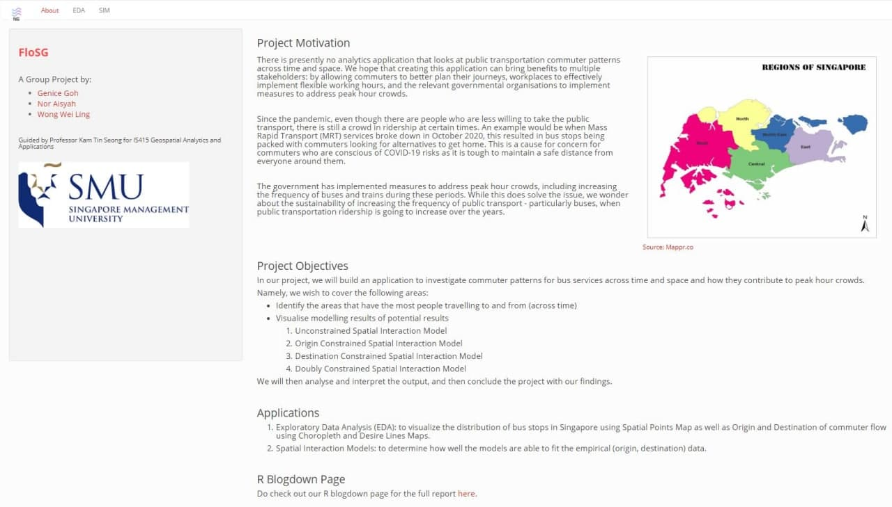
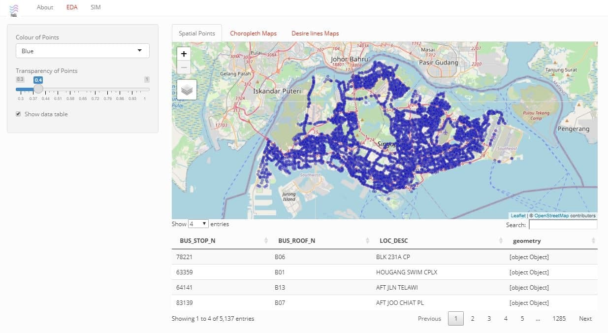
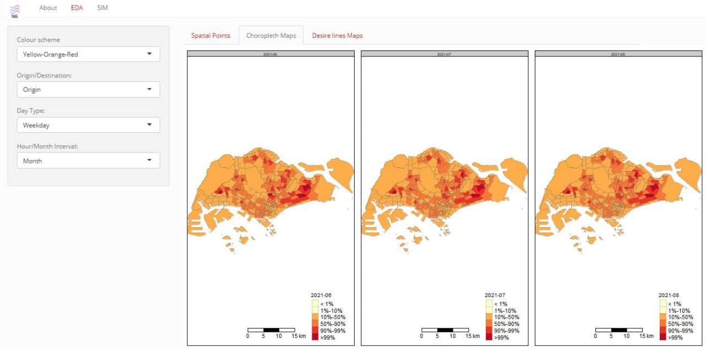
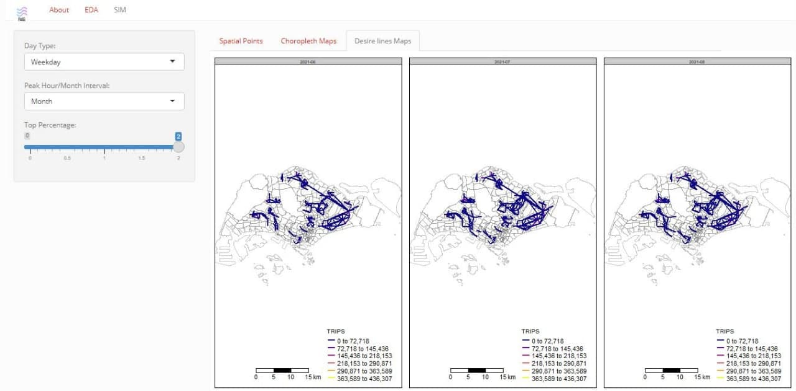
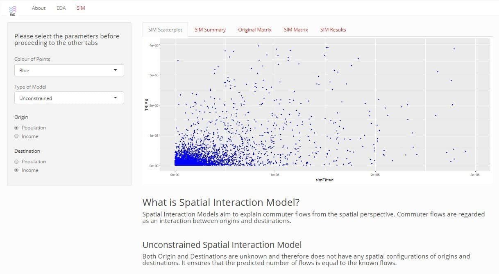
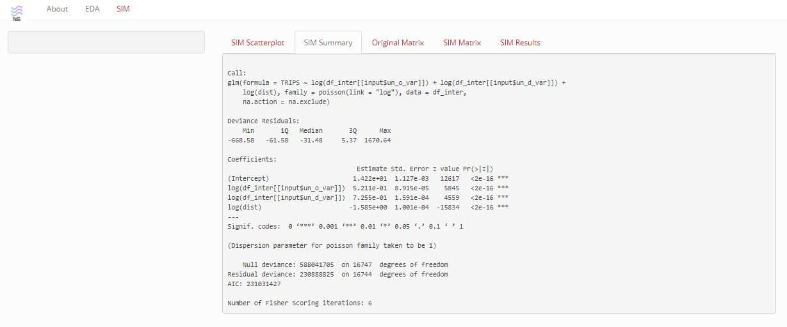
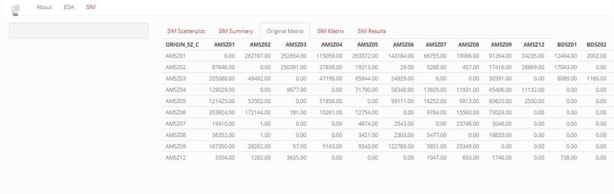
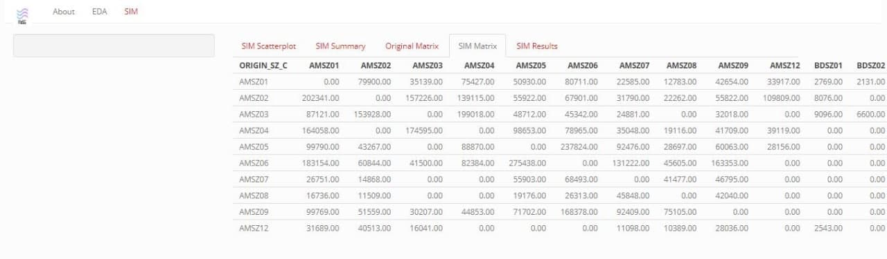
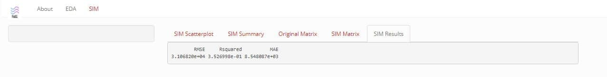

```{r setup, include=FALSE}
knitr::opts_chunk$set(echo = TRUE)
```

# Exploratory Data Analysis
- Navigate to the EDA tab


- In the Spatial Points tab, wait for the application to load. You should be able to see a Spatial Points Map showing the bus stops in Singapore with the default settings. You can also configure your analysis by setting the options below:
  - The colour of the points
  - The transparency the points
  - Whether you would like the data table to be displayed
  
  
  
- In the Choropleth Maps tab, wait for the application to load. You should be able to see 3 Choropleth (Percentile) Maps showing outliers of the trips with the default settings. You can also configure your analysis by setting the options below:
  - Which colour scheme 
  - Whether to group by origin/destination
  - Which day type to group by
  - Which interval to group by, namely, by months, by peak hours of by both months & peak hours
  - Which top percentage by trips (in the interval of 0.5)
  
- In the Desire Lines tab, wait for the application to load. You should be able to see 3  Desire Lines Map of trips from the origin to the destination with the default settings. You can also configure your analysis by setting the options below:
  - Which day type to group by
  - Which interval to group by, namely, by months, by peak hours of by both months & peak hours
  - Which top percentage by trips (in the interval of 0.5)
  

# Spatial Interaction Models
- Navigate to the SIM tab

- In the SIM Scatterplot tab, wait for the application to load. You should be able to see a Scatterplot showing the actual and estimated flow  with the default settings. You can also configure your analysis by setting the options below:
  - The colour of the points
  - Which SIM model (based on the model you choose, different radio buttons will appear at the bottom)
  - For unconstrained, pick either population or income for both origin & destination
  - For origin, pick either population or income for destination
  - For destination, pick either population or income for origin
  - For doubly, there will be no options to pick from
  
- In the SIM summary tab, you will be able to see the summary of the calibrated models

- In the Original Matrix tab, you will be able to see the original number of trips from 1 subzone to another

- Similarly, in the SIM Matrix tab, you will be able to see the new flow estimates from 1 subzone to another

- In the SIM Results tab, you will be able to see the results of the type of model you have chosen in the SIM Scatter plot tab



