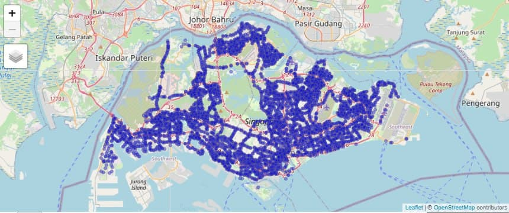
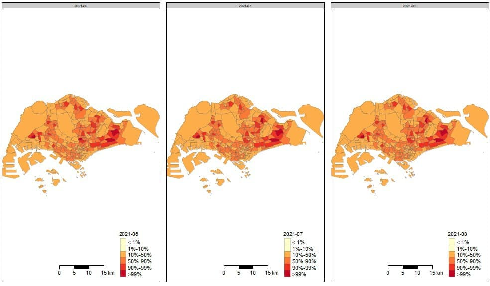
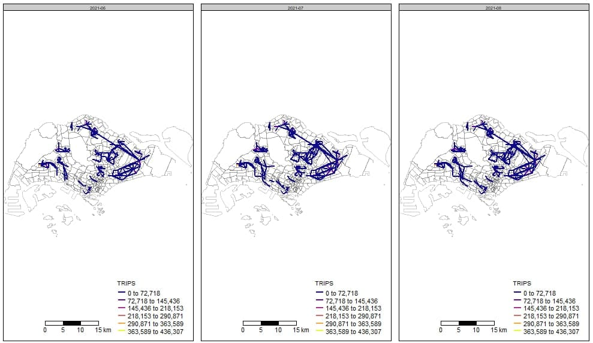
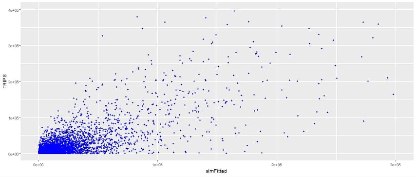

```{r setup, include=FALSE}
knitr::opts_chunk$set(echo = FALSE)
```

# Issues and Problems
Peak hour crowds in public transportation have always been a problem in Singapore. The Land Transport Authority (LTA) - Singapore has implemented a variety of measures to address this issue by increasing the frequencies of trains and buses during peak hours, and giving fare discounts to those who travel earlier than the morning peak hours. 

<br>

# Motivation

Since the pandemic, even though there are people who are less willing to take the public transport, there is still a crowd in ridership at certain times. An example would be when Mass Rapid Transport (MRT) services broke down in October 2020, this resulted in bus stops being packed with commuters looking for alternatives to get home. This is a cause for concern for commuters who are conscious of COVID-19 risks as it is tough to maintain a safe distance from everyone around them.

The government has implemented measures to address peak hour crowds, including increasing the frequency of buses and trains during these periods. While this does solve the issue, we wonder about the sustainability of increasing the frequency of public transport - particularly buses, when public transportation ridership is going to increase over the years.

There is presently no analytics application that looks at public transportation commuter patterns across time and space. We hope that creating this application can bring benefits to multiple stakeholders: by allowing commuters to better plan their journeys, workplaces to effectively implement flexible working hours, and the relevant governmental organisations to implement measures to address peak hour crowds.

<br>

# Approach

Spatial Interaction Models aim to explain commuter flows from the spatial perspective. Commuter flows are regarded as an interaction between origins and destinations. 

- **Unconstrained Spatial Interaction Model**
  - Both Origin and Destinations are unknown and therefore does not have any spatial configurations of origins and destinations
  - Ensures that the predicted number of flows is equal to the known flows

- **Origin Constrained Spatial Interaction Model**
  - Here, Origin is known and Destination is unknown
  - Deals with outgoing flows in terms of ensuring that the sum of the estimated outflows observed outflows from each origin is the same 

- **Destination Constrained Spatial Interaction Model**
  - Here, Destination is known and Origin is unknown
  - Deals with incoming flows in terms of ensuring that the sum of the estimated and observed inflows for each destination is the same

- **Doubly Constrained Spatial Interaction Model**
  - Both Origin and Destinations are known
  - Ensures that both of these pairs of sums are the same

<br>
<br>
<br>


# Results
 
**Spatial Points**
 <center>
{width=75%}
 </center>

**Choropleth Map**
<center>
{width=75%}
 </center>
 
 
**Desire Lines**
 <center>
{width=75%}
 </center>
 

**Spatial Interaction Models**
 <center>
{width=75%}
 </center>


<br>
<br>
<br>


# Future Work
 
- **Feature for users to upload their preferred origin and destination of bus trips data**
Currently, the study focuses on the origin destination of bus trips data in the months of June, July and August in 2021. Hence, the results that users are seeing are only accurate to the aforementioned months. If there are opportunities to enhance this application, giving the users the option to upload their own data would be implemented. This way, users are able to use this application to determine the results of their preferred origin and destination of bus trips datasets. 

- **Cover other modes of transport**
In addition to only focusing on the origin and destination of bus trips data, this study can also be refined to cover other modes of transport like Mass Rapid Transport in Singapore. 


```{r, include=FALSE}
knitr::write_bib(c('knitr','rmarkdown','posterdown','pagedown'), 'packages.bib')
```
 


# References
 

- Group08 application. Group08 application - ISSS608-Visual Analytics and Applications. (n.d.). Retrieved November 18, 2021, from https://wiki.smu.edu.sg/1920t2isss608/Group08_application.
- Harrison, J. (2020, October 21). Commentary: Singapore's new headache of fewer public transport commuters. CNA. Retrieved November 18, 2021, from https://www.channelnewsasia.com/commentary/public-transport-mrt-bus-capacity-breakdown-covid-car-share-968131.
- Lta.gov.sg. LTA. (n.d.). Retrieved November 18, 2021, from https://www.lta.gov.sg/content/ltagov/en/newsroom/2014/7/3/steps-taken-to-reduce-bus-crowding-during-peak-hours.html.
- Morning pre-peak fares. Public Transport Council. (n.d.). Retrieved November 15, 2021, from https://www.ptc.gov.sg/fare-regulation/bus-rail/morning-pre-peak-fares.
- RStudio Shiny Contest 2021 - Commute Explorer. Data Science Academy. (n.d.) Retrieved November 15, 2021, from https://nz-stefan.shinyapps.io/commute-explorer-2/
- Spreading out the peak hour MRT crowd. Ministry of Transport. (n.d.). Retrieved November 15, 2021, from https://www.mot.gov.sg/Transport-Matters/public-transport/Detail/spreading-out-the-peak-hour-mrt-crowd.
- World Leaders in Research-Based User Experience. (April 24, 1994). 10 usability heuristics for user interface design. Nielsen Norman Group. Retrieved November 15, 2021 from https://www.nngroup.com/articles/ten-usability-heuristics/.
- Sites.google.com. Desire Lines - Piggraphy Alevel Skills (n.d.). Retrieved November 15, 2021 from https://sites.google.com/site/piggraphy/home/cartographic-d/desire-lines

